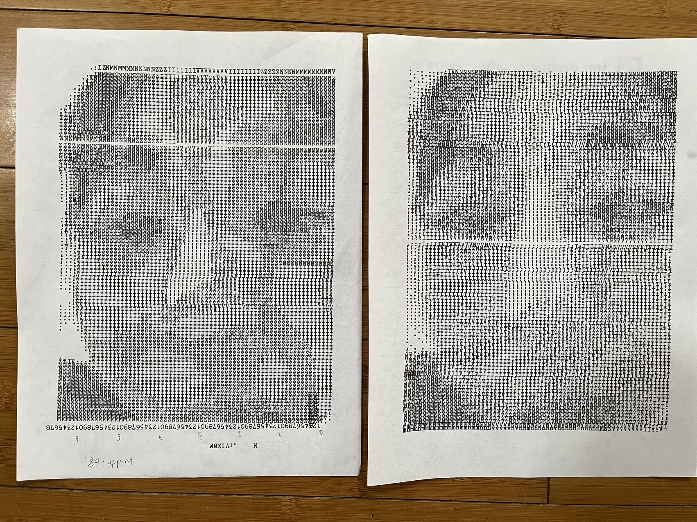

# Typewriter ASCII art

This repository contains a program that can turn images like this one


into this:



The code is in `src/main.rs`. When run, it will load the file named `input_image.JPG` and then it will generate an output image of dimensions specified in `output_image_config.txt`. An output image will be saved to `test.png`, but the program will also print out the ASCII representation of the image.

Besides the raw ASCII representation, the program also produces an output using run-length encoding. Below the first line shows the raw ASCII representation, while the second line shows the run-length encoded output. All repeated bursts longer than 2 characters will be written with by specifying the length of the run.

```text
MMMMMMMMNMMMMMMMMMMNNNNVVVVVNNNNNMNNVNVNNVNNNNVNNNNNMNNVVVVVVVVI;;II
(M 8) N (M 10)  (N 4)  (V 5)  (N 5) MNNVNVNNV (N 4) V (N 5) MNN (V 8) I;;II 
```

The run-length encoded output is shown to aid someone who might want to manually type each letter on a typewriter for a physical representation of the art.

Note that the space character is represented as a `0`, in order to not confuse human readers by printing whitespace. If you desire a literal `' '` to be printed, you may modify the representation in the line which declares `const CHAR_SET`;
